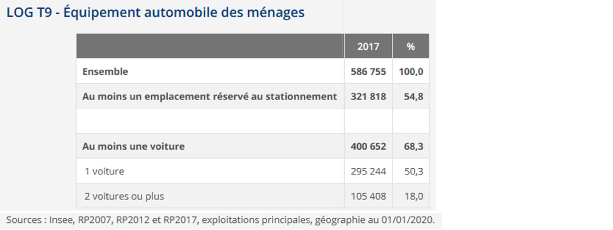
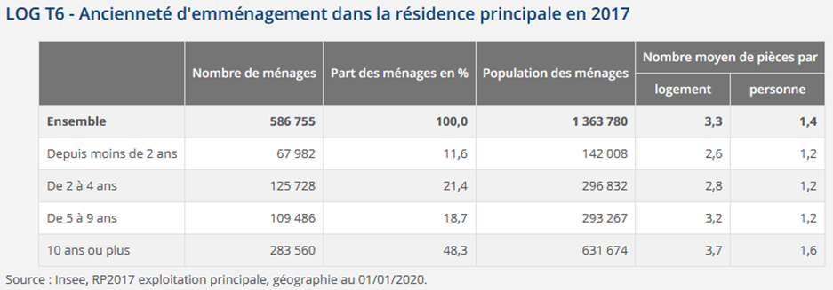

# Analyse statistique (CS) {#c12-statistics1}

```{r setup2, include=FALSE}
knitr::opts_chunk$set(echo = TRUE)
library(kableExtra)
```

<div align="justify">

```{r warning=FALSE, message=FALSE}
# On charge les librairies principales que l'on va utiliser
library(knitr)
library(tidyverse)
library(data.table)
library(questionr)
library(RColorBrewer)
```


```{r, echo=FALSE}
RP<-readRDS(file ="data/indiv2017.Rdata") 
```


## Introduction 

### Les données du Recensement de la Population (RP)
Il existe plusieurs fichiers disponibles sur le site de l'Insee concernant l'enquête du Recensement de la Population, la dernière année disponible datant de 2017. Ces fichiers sont lourds, ils peuvent être téléchargés par zone, c'est ce que nous allons faire ensuite.

Soit vous le téléchargez *via* internet et enregistrez le fichier dans un de vos dossiers bien spécifiés et vous le "dézippez", soit vous le télécharger directement dans `R`.

On va s'intéresser  au fichier "Individus localisés au canton-ou-ville" : on le télécharge pour la zone A c'est-à-dire l'Ile-de-France.
```{r eval=FALSE, message=FALSE}
download.file(url="https://www.insee.fr/fr/statistiques/fichier/4802064/RP2017_INDCVIZA_csv.zip", 
              destfile = "tmp/RP2017_INDCVIZA_csv.zip")
#Le fichier a donc été téléchargé dans le dossier intitulé "tmp" du projet R, on va maintenant le dézippé et enregistrer les fichiers extraits dans le même dossier.
unzip("tmp/RP2017_INDCVIZA_csv.zip", 
      exdir = "tmp")
```

Il nous reste plus qu'à charger les données dans R : pour cela on utilise la commande `fread` du package `data.table` car cela va bien plus vite que les fonctions plus habituelles du type `read.csv`, et on vérifie en regardant les premiers éléments de la table qu'elle a bien été chargée : 
```{r, eval=FALSE}
#library(data.table)
RP <- fread("tmp/FD_INDCVIZA_2017.csv", stringsAsFactors=TRUE)
RP <- as.data.frame(RP)
head(RP)
str(RP)
```
On a donc 88 variables et plus de 4 341 175 observations pour l'ensemble de l'Ile de France. Le fait que le nombre d'individus recensés soit inférieur à la population totale de l'Ile de France (plus de 12 millions d'habitants au RP 2017) s'explique par les méthodes de sondage utilisées dans le nouveau recensement en France depuis les années 2000. C'est la raison pour laquelle tous les calculs doivent être pondérés par la variable `IPONDI`pour être représentatifs


Certaines des variables ont été codées comme numériques alors que, selon le dictionnaire des variables, elles devraient être toutes en caractères ou ici dans `R` en facteurs, on va regarder quelles variables sont concernées et on va les transformer pour qu'elles soient dans le bon format. Ci-dessous, la fonction `select_if` du package `dplyr` permet de sélectionner les variables avec une condition (d'où le "if") donnée entre parenthèses, ici donc si ces variables ont le format "numeric" : 

```{r, eval=FALSE}
RP %>% 
  select_if(is.numeric) %>%
  names()
```

On en a 23 sur 88, mais attention il y a la variable de pondération `IPONDI` qui, elle, doit rester numérique, donc on peut procéder au changement de type pour l'ensemble de ces variables sauf celle de pondération, avec la fonction `mutate_at` en spécifiant l'ensemble des variables concernées (copiées-collées depuis la sortie précédente en veillant bien sûr à bien enlever `IPONDI`), et vérifier.
```{r,eval=FALSE,}
RP %>% 
  mutate_at(c("AGED", "AGER20", "AGEREV", "AGEREVQ", "ANAI", "CATPC", "COUPLE", "CS1", "DEPT",
              "ETUD", "IMMI", "INAI", "INATC", "MOCO", "MODV", "NAIDT", "ORIDT", "REGION", "SEXE",
              "STAT_CONJ","TACT",  "TACTD16"), factor) %>%
  select_if(is.numeric) %>%
  head(5)
```

On remplace maintenant la table et dans le même temps on ne garde que le département du Val de Marne (variable `DEPT`, modalité `'94'`) sur lequel on va travailler. On procède donc finalement avec le code suivant : 

```{r, eval=FALSE}
RP <- RP %>% 
        mutate_at(c("AGED", "AGER20", "AGEREV", "AGEREVQ", "ANAI", "CATPC", "COUPLE", "CS1", "DEPT",
                    "ETUD", "IMMI", "INAI", "INATC", "MOCO", "MODV", "NAIDT", "ORIDT", "REGION", "SEXE",
                    "STAT_CONJ", "TACT",  "TACTD16"), factor) %>%
        filter(DEPT=='94') 
```

On se retrouve avec une table moins lourde puisqu'il y a dorénavant `r format(nrow(RP), big.mark=" ")` observations.

On peut enregistrer ce fichier, ainsi que celui contenant les métadonnées dans le dossier `R` au format RDS avec la fonction `saveRDS`.

```{r, eval=FALSE}
saveRDS(object = RP,
        file = "data/indiv2017.Rdata")
# Lecture du fichier de métadonnées et enregistrement dans le dossier Data de notre projet
meta <- fread("tmp/varmod_INDCVI_2017.csv")
# Enregistrement dans le dossier data
saveRDS(object = meta,
        file = "data/indiv_2017_meta.Rdata")
```

Pour l'importer, il faudra utiliser la fonction `readRDS`, comme l'exemple ci-dessous (sans l'exécuter) :

```{r eval=TRUE}
RP<-readRDS(file ="data/indiv2017.Rdata") 
```


### Quelles variables sont présentes dans les données ? Quelle spécificité ?

L'une des difficultés pour l'analyse de cette base de données réside dans les différents niveaux présents : "individu" pour la personne de référence du ménage ; "ménage" regroupant l’ensemble des occupants d’une résidence principale, qu'ils aient ou non des liens de parenté ; "famille" partie d'un ménage comprenant au moins 2 personnes (par exemple, un couple, ou un adulte avec un enfant...) ; et enfin "logement" qui comprend ici les  **résidences principales**, et rassemble des informations décrivant les types de logement.


Pour se familiariser avec cette base de données, puisque cette année le projet que vous devrez réaliser porte sur cette base, il faut d'abord étudier les variables qu'elle contient. Un premier travail va ainsi consister à trier les 88 variables selon 5 thèmes :

- variables décrivant le logement ;
- variables décrivant le ménage ; 
- variables décrivant la famille ;
- variables décrivant l'individu ; 
- variables géographiques.

Une fois cela effectué, il faut comprendre comment utiliser à bon escient ces différents niveaux. Ainsi, pour toute variable au niveau logement, ménage et famille, il faudra utiliser un filtre : ne prendre que la personne de référence du ménage. On peut toutefois vouloir donner des statistiques sur la "population des ménages". C'est ce que nous allons voir, en prenant appui sur les statistiques produites par l'Insee pour ce département.


## Quelques statistiques sur les logements et ménages

**Premier exercice à faire** : étudier l'équipement automobile des ménages, en essayant de retrouver les statistiques ci-dessous de l'Insee dont la source est [ici](https://www.insee.fr/fr/statistiques/4515899?sommaire=4515952&geo=DEP-94).

<center>




</center>

```{r}
#Emplacement stationnement : 
RP %>% 
  filter(LPRM=="1") %>%
  mutate(Stationnement=recode(GARL, "1"="Au moins un emplacement réservé au stationnement", 
                     "2" = "Aucun emplacement")) %>%
  count(Stationnement, wt=IPONDI) %>%  
  mutate(n=round(n,0),pct=prop.table(n)*100, pct=round(pct, 1)) %>%
  kable(format.args = list(big.mark = " "))

#Voiture : 
RP %>% 
  filter(LPRM=="1") %>%
  mutate(Voiture=case_when(VOIT %in% c("1", "2", "3") ~ "Au moins une voiture",
                        VOIT=="0" ~ "Pas de voiture")) %>%
  count(Voiture, wt=IPONDI) %>%
  mutate(n=round(n,0),pct=prop.table(n)*100, pct=round(pct, 1)) %>%
  kable(format.args = list(big.mark = " "))

RP %>% 
  filter(LPRM=="1") %>%
  mutate(Nb_voiture=case_when(VOIT=="1" ~ "1 voiture", VOIT %in% c("2", "3") ~ "2 voitures ou plus",
                           VOIT=="0" ~ "Pas de voiture")) %>%
  count(Nb_voiture, wt=IPONDI) %>%
  mutate(n=round(n,0),pct=prop.table(n)*100, pct=round(pct, 1)) %>%
  kable(format.args = list(big.mark = " "))
```


**Second exercice à faire** : étudier l'ancienneté d'emménagement dans la résidence principale en 2017, en essayant de retrouver de même les statistiques ci-dessous de l'Insee (même source : [ici](https://www.insee.fr/fr/statistiques/4515899?sommaire=4515952&geo=DEP-94)) : 

<center>



</center>


```{r}
#Ancienneté d'emménagement en nombre de ménage
RP %>% 
  filter(LPRM=="1") %>%
  mutate(Anciennete=case_when(ANEMR=="00" ~ "Depuis moins de 2 ans", ANEMR=="01" ~ "De 2 à 4 ans",
                       ANEMR=="02" ~ "De 5 à 9 ans", as.numeric(ANEMR)>3 ~ "10 ans ou plus"),
         Anciennete = factor(Anciennete, 
                      levels=c("Depuis moins de 2 ans","De 2 à 4 ans","De 5 à 9 ans","10 ans ou plus"))) %>%
  count(Anciennete, wt=IPONDI) %>%
  mutate(n=round(n,0),pct=prop.table(n)*100, pct=round(pct, 1)) %>%
  bind_rows(summarise(Anciennete = "Ensemble", RP[RP$LPRM=="1", ], n = sum(IPONDI), pct = 100.0)) %>%
  kable(format.args = list(big.mark = " "))

#Ancienneté d'emménagement en population des ménages
RP %>% 
  filter(CATL=="1") %>%
  mutate(Anciennete=case_when(ANEMR=="00" ~ "Depuis moins de 2 ans", ANEMR=="01" ~ "De 2 à 4 ans",
                       ANEMR=="02" ~ "De 5 à 9 ans", as.numeric(ANEMR)>3 ~ "10 ans ou plus"),
         Anciennete = factor(Anciennete, 
                      levels=c("Depuis moins de 2 ans","De 2 à 4 ans","De 5 à 9 ans","10 ans ou plus")),
         nb_pieces=as.numeric(as.character(NBPI))) %>%
  count(Anciennete, wt=IPONDI) %>%
  mutate(n=round(n,0), pct=prop.table(n)*100, pct=round(pct, 1)) %>%
  bind_rows(summarise(Anciennete = "Ensemble", RP[RP$CATL=="1", ], n = sum(IPONDI), pct = 100.0)) %>%
  kable(format.args = list(big.mark = " "))

#Nombre moyen de pièces par logement
RP %>% 
  filter(LPRM=="1") %>%
  mutate(Anciennete=case_when(ANEMR=="00" ~ "Depuis moins de 2 ans", ANEMR=="01" ~ "De 2 à 4 ans",
                       ANEMR=="02" ~ "De 5 à 9 ans", as.numeric(ANEMR)>3 ~ "10 ans ou plus"),
         Anciennete = factor(Anciennete, 
                      levels=c("Depuis moins de 2 ans","De 2 à 4 ans","De 5 à 9 ans","10 ans ou plus")),
         Np_pieces=as.numeric(as.character(NBPI))) %>%
  group_by(Anciennete) %>%
  summarise(Np_pieces_moy=weighted.mean(Np_pieces, IPONDI, na.rm=T)) %>%
  bind_rows(summarise(Anciennete = "Ensemble", RP[RP$LPRM=="1", ],
                      Np_pieces_moy = weighted.mean(as.numeric(as.character(NBPI)), 
                                                    IPONDI, na.rm=T))) %>%
  mutate(Np_pieces_moy=round(Np_pieces_moy, 1)) %>%
  kable(format.args = list(big.mark = " "))

#Nombre moyen de pièces par personne
RP %>% 
  filter(CATL=="1") %>% 
  mutate(nb_pieces=as.numeric(as.character(NBPI)), nb_pers=as.numeric(as.character(INPER)),
         np_pieces_pers=nb_pieces/nb_pers,
         Anciennete=case_when(ANEMR=="00" ~ "Depuis moins de 2 ans", ANEMR=="01" ~ "De 2 à 4 ans",
                       ANEMR=="02" ~ "De 5 à 9 ans", as.numeric(ANEMR)>3 ~ "10 ans ou plus"),
         Anciennete = factor(Anciennete, 
                      levels=c("Depuis moins de 2 ans","De 2 à 4 ans","De 5 à 9 ans","10 ans ou plus"))) %>%
  group_by(Anciennete) %>%
  summarise(Moy_pieces_pers=weighted.mean(np_pieces_pers, IPONDI, na.rm=T)) %>% 
  bind_rows(summarise(Anciennete = "Ensemble", RP[RP$CATL=="1", ],
                      Moy_pieces_pers=weighted.mean(as.numeric(as.character(NBPI))/as.numeric(as.character(INPER)), IPONDI, na.rm=T))) %>%
  mutate(Moy_pieces_pers=round(Moy_pieces_pers, 1)) %>%
  kable(format.args = list(big.mark = " "))
```

C'est néanmoins plutôt du côté des graphiques que `R` excelle en la matière, avec le fameux package `ggplot`. On va maintenant essayer de travailler ce package avec ses différentes fonctions.

Si besoin, pour vous aider à démarrer avec `ggplot`, 2 liens utiles : [ici](https://larmarange.github.io/analyse-R/graphiques-bivaries-ggplot2.html) et [là](https://r-toulouse.netlify.app/diapos/2018-09-25_ggplot2_initiation.pdf).


Dans la continuité des statistiques réalisées précédemment, **troisième exercice à faire** : réalisez d'abord un graphique représentant l'ancienneté d'emménagement des ménages dans le Val de Marne en 2017, selon 6 catégories ("Depuis moins de 2 ans", "De 2 à 4 ans", "De 5 à 9 ans", "De 10 à 19 ans", "De 20 à 29 ans", "30 ans ou plus") et en pourcentage. On peut repartir du 1er code précédent en ajoutant des catégories, puis en utilisant un `ggplot()`. 

```{r}
# 2 exemples : 

#Avec geom_col() qui crée un diagramme à barres ou graphique en colonnes
RP %>% 
  filter(LPRM=="1" & CATL=="1") %>%
  mutate(anc=case_when(ANEMR=="00" ~ "Depuis moins de 2 ans", ANEMR=="01" ~ "De 2 à 4 ans",
                       ANEMR=="02" ~ "De 5 à 9 ans", ANEMR=="03" ~ "De 10 à 19 ans",
                       ANEMR=="04" ~ "De 20 à 29 ans", as.numeric(ANEMR)>=5 ~ "30 ans ou plus"),
         anc = factor(anc, levels=c("Depuis moins de 2 ans", "De 2 à 4 ans", "De 5 à 9 ans",
                                    "De 10 à 19 ans", "De 20 à 29 ans", "30 ans ou plus"))) %>%
  count(anc, wt=IPONDI) %>%
  mutate(pct=prop.table(n)*100, pct=round(pct, 1)) %>%
  ggplot() + aes(x=anc, y=pct, fill=anc) + geom_col() + scale_fill_brewer(palette = "Set2") +
  geom_text(aes(y=pct, label=pct), vjust=1.5, color="gray30", size=4) + 
  labs(title = "Ancienneté d'emménagement des ménages en 2017 dans le Val de Marne", x="", y="") +
  theme_bw() + theme(legend.position = "none") 

#Ou avec geom_bar(), mais en mettant l'option " stat="identity" " car on donne déjà les valeurs avec y=pct
RP %>% 
  filter(LPRM=="1" & CATL=="1") %>%
  mutate(anc=case_when(ANEMR=="00" ~ "Depuis moins de 2 ans", ANEMR=="01" ~ "De 2 à 4 ans",
                       ANEMR=="02" ~ "De 5 à 9 ans", ANEMR=="03" ~ "De 10 à 19 ans",
                       ANEMR=="04" ~ "De 20 à 29 ans", as.numeric(ANEMR)>=5 ~ "30 ans ou plus"),
         anc = factor(anc, levels=c("Depuis moins de 2 ans", "De 2 à 4 ans", "De 5 à 9 ans",
                                    "De 10 à 19 ans", "De 20 à 29 ans", "30 ans ou plus"))) %>%
  count(anc, wt=IPONDI) %>%
  mutate(pct=prop.table(n)*100, pct=round(pct, 1)) %>%
  ggplot() + aes(x=anc, y=pct, fill=anc) + geom_bar(stat="identity") + scale_fill_brewer(palette = "Dark2") +
  geom_text(aes(y=pct, label=pct), vjust=1.5, color="gray22", size=4) + 
  labs(title = "Ancienneté d'emménagement des ménages en 2017 dans le Val de Marne", x="", y="") +
  theme(legend.position = "none")
```

Réalisez ensuite un graphique de la distribution du nombre de pièces par type de logement en ne considérant que les maisons et appartements. Par exemple, cela pourrait donner cela : 

```{r warning=FALSE}
RP %>%   
  filter(LPRM=="1" & TYPL %in% c("1", "2")) %>%
  mutate(nb_pieces=as.numeric(as.character(NBPI)), TYPL=recode(TYPL, "1"="Maison", "2"="Appartement"))  %>%
  ggplot() + aes(x=nb_pieces, y=TYPL, fill=TYPL) + geom_boxplot(outlier.shape = NA) + coord_flip() + 
  stat_summary(fun=mean, geom="point", shape=20, size=4) +  scale_x_continuous(limits = c(1, 8)) +
  labs(title="Nombre de pièces par ménage selon le type de logement en 2017", x="Nombre de pièces",
       y="Type de logement")  + theme(legend.position = "none")
```


## Quelles caractéristiques des individus résidant dans le Val de Marne en 2017 ?
On va s'intéresser maintenant aux caractéristiques des individus qui résident dans ce département du Val de Marne. On peut ainsi décrire la population selon les variables suivantes : l'âge, le sexe, la situation quant à l'immigration, le diplôme, la catégorie sociale, le type d'activité ou encore les conditions d'emploi.


**Premier exercice à faire** : faire un graphique décrivant la population de 15 ans ou plus selon la catégorie socioprofessionnelle (CS). Puis un second, différenciant la population par sexe, en plus de la CS (vous pourrez enlever les agriculteurs peu nombreux).

```{r}
#Population de 15 ans ou plus selon la catégorie socioprofessionnelle (et sans les agriculteurs trop peu nombreux)
RP %>% 
  filter(!AGER20 %in% c("02", "05", "10", "14") & TACT!="23" & CS1!="1") %>%
  count(CS1, wt=IPONDI) %>%
  mutate(pct=prop.table(n)*100, pct=round(pct, 1),
         CS1=recode(CS1, "2"="Artisans, commerçants et chefs d'entreprise", 
                    "3"="Cadres et professions intellectuelles supérieures", 
                    "4"="Professions Intermédiaires", "5"="Employés", "6"="Ouvriers",
                    "7"="Retraités", "8"="Autres personnes sans activité professionnelle")) %>%
  ggplot() + aes(x=CS1, y=pct, fill=CS1) + geom_col() + scale_fill_brewer(palette = "Set2") +
  geom_text(aes(y=pct, label=pct), vjust=1.5, color="gray30", size=4) + 
  labs(title = "Population de 15 ans ou plus selon la catégorie socioprofessionnelle", x="", y="") +  
  theme(legend.position = "none", axis.text.x = element_text(angle = 75, hjust=1))

#Population de 15 ans ou plus par sexe et catégorie socioprofessionnelle (et sans les agriculteurs trop peu nombreux)
RP %>% 
  filter(!AGER20 %in% c("02", "05", "10", "14") & TACT!="23" & CS1!="1") %>%
  group_by(SEXE) %>%
  count(CS1, wt=IPONDI) %>%
  mutate(pct=prop.table(n)*100, pct=round(pct, 1),
         CS1=recode(CS1, "2"="Artisans, commerçants et chefs d'entreprise", 
                    "3"="Cadres et professions intellectuelles supérieures", 
                    "4"="Professions Intermédiaires", "5"="Employés", "6"="Ouvriers",
                    "7"="Retraités", "8"="Autres personnes sans activité professionnelle"),
         SEXE=recode(SEXE, "1"="Homme", "2"="Femme")) %>%
  ggplot() + aes(x=CS1, y=pct, fill=CS1) + geom_bar(stat="identity")+
  facet_wrap(~SEXE,nrow=1, ncol=2) +  scale_fill_brewer(palette = "Set2") +
  geom_text(aes(y=pct, label=pct), vjust=1, color="gray23", size=3.5) + 
  labs(title = "Population de 15 ans ou plus par sexe et catégorie socioprofessionnelle", x="", y="") +  
  theme_grey() + theme(axis.text.x=element_blank(), axis.ticks.x=element_blank(),
                       legend.position="bottom", legend.title = element_blank(), 
                       plot.title = element_text(hjust = 0.5))
```


On peut dorénavant s'intéresser aux personnes en emploi, **second exercice à faire** : faîtes un graphique représentant la population de 15 ans ou plus en emploi par statut (salariés/non-salariés), sexe et catégorie socioprofessionnelle (en enlevant de nouveau les agriculteurs)

```{r}
RP %>% 
  filter(!AGER20 %in% c("02", "05", "10", "14") & TACT=="11" & CS1!="1") %>%
  mutate(EMPL=case_when(EMPL %in% c("11","12","13","14","15","16") ~ "Salariés", 
                              EMPL %in% c("21","22","23") ~ "Non Salariés"),
         CS1=recode(CS1, "2"="Artisans, commerçants et chefs d'entreprise", 
                    "3"="Cadres et professions intellectuelles supérieures", 
                    "4"="Professions Intermédiaires", "5"="Employés", "6"="Ouvriers",
                    "7"="Retraités", "8"="Autres personnes sans activité professionnelle"),
         SEXE=recode(SEXE, "1"="Homme", "2"="Femme")) %>%
  group_by(SEXE, EMPL) %>%
  count(CS1, wt=IPONDI) %>%
  mutate(pct=prop.table(n)*100, pct=round(pct, 1)) %>%
  ggplot() + aes(x =SEXE, y=pct, fill = CS1) + geom_bar(stat="identity") +
  facet_wrap(~EMPL, nrow=1, ncol=2)  +  scale_fill_brewer(palette = "Set2") +
  geom_text(aes(label = after_stat(y)), color="gray24",  position = position_stack(.5)) +
  labs(title = "Population de 15 ans ou plus en emploi par statut, sexe et catégorie socioprofessionnelle",
       x="", y="", fill="Catégorie socio-professionnelle") +  
  theme_grey() + theme(legend.position="right")
```


##  La création de fonctions

Et oui, le copier-coller c'est bien et simple, mais voilà pour ré-utiliser un code de façon plus automatique, créer des fonctions est très utile (et on peut même les stocker dans un fichier  `.r` pour les réutiliser plus tard pour une autre étude). 

L'idée est qu'à partir d'un bloc d'instructions ou de lignes de code, on l'intègre dans une fonction qui portera un nom et qui pourra être appliquée sur les paramètres que l'on veut (table/objet différent, ici communes différentes, variables différentes) et qui nous retournera une valeur en sortie (qu'il faut préciser donc). Par exemple : 

```{r eval=FALSE}
#Les "..." seront des instructions bien sûr !
nom_fonction <- function(data, var)
{
  tab <- data %>% 
            ... %>% 
            ...

  return(tab)
}

#L'appel de la fonction devra ainsi préciser la table de données sur laquelle l'appliquer et les autres arguments : 
nom_fonction(data = nom_de_ma_table , var = nom_de_ma_variable)

#De plus, on pourra créer un nouvel objet (ici "tab_var") pour stocker la table qui est en valeur de sortie de la fonction : 
tab_var <- nom_fonction(data = nom_de_ma_table , var = nom_de_ma_variable)
```


### Création d'une fonction pour retourner un tableau

Alors, reprenons notre code précédent (ci-dessous), et essayons d'écrire une fonction pour faire des sorties de tableaux, de sorte qu'il suffise d'appeler cette fonction en indiquant le nom de notre table, de notre commune et de notre variable. On n'exécute pas de nouveau ce code, mais on l'affiche seulement sur notre script : pour cela il faut, dans le chunk, mettre l'option `eval=FALSE` comme ceci : `{r eval=FALSE}`.

```{r eval=FALSE}
#Rappel exemple code précédent (avec ajout de la commune prise en référence - Sucy-en-Brie) : 
RP %>% 
  mutate(COM = substr(IRIS,1,5)) %>%
  filter(LPRM=="1" & COM == "94071") %>%
  mutate(Nb_voiture=case_when(VOIT=="1" ~ "1 voiture", VOIT %in% c("2", "3") ~ "2 voitures ou plus",
                           VOIT=="0" ~ "Pas de voiture")) %>%
  count(Nb_voiture, wt=IPONDI) %>%
  mutate(n=round(n,0),pct=prop.table(n)*100, pct=round(pct, 1))
```

On crée donc une fonction qu'on appelle `tab_menage` avec comme paramètres "data", "codecom" et "var" qui s'appliquerait dans le cas de statistiques au niveau "ménages" :

```{r}
tab_menage <- function(data, codecom, var)
{
  tab <- data %>% 
          mutate(COM = substr(IRIS,1,5)) %>%
          filter(LPRM=="1" & COM == codecom) %>%
          count({{ var }}, wt=IPONDI) %>%  
          mutate(n=round(n,0), pct=prop.table(n)*100, pct=round(pct, 1))

  return(tab)
}
```

Le plus difficile ici est l'appel de la variable dans la fonction notamment lorsqu'on utilise le langage `dplyr` : une méthode (mais il en existe une autre, cf. [ici](https://thinkr.fr/comment-creer-des-fonctions-dans-le-tidyverse-avec-la-tidyeval-et-le-stash-stash/)) est d'utiliser les `{{ }}`. En outre, il ne faut pas oublier de préciser la valeur de sortie avec `return()`.

En revanche, si l'on veut recoder la variable soit en regroupant des modalités, soit en renommant les modalités (ou les 2 !), il faudra le faire dans une étape préalable. De manière générale, il est bien comme on l'a vu dans les 2 premières séances de ce ciyrs (cf. script de cours associé) de prendre le temps de bien préparer la table, recoder toutes les variables comme on le souhaite, inspecter et traiter les valeurs manquantes, etc., avant l'étape de l'analyse statistique des données.

Ainsi, si l'on reprend l'exemple des trois premiers tableaux que nous avons réalisés lors de la dernière séance (cf. plus haut), on peut le refaire en 2 étapes : préparation de la table, et appel des fonctions. (On peut aussi intégrer la fonction dans un code `dplyr` en ajoutant un `%>%`, dans ce cas il faut enlever le paramètre "data = " dans la fonction lorsqu'on l'appelle, cf. après.)

```{r}
# Etape 1 : création d'une nouvelle table (ou en remplacement si on l'appelle de la même façon)
RP <- RP %>% 
        mutate(Stationnement = recode(GARL, "1" = "Au moins un emplacement réservé au stationnement", 
                                            "2" = "Aucun emplacement"),
               Voiture = case_when(VOIT %in% c("1", "2", "3") ~ "Au moins une voiture",
                                         VOIT == "0" ~ "Pas de voiture"),
               Nb_voiture = case_when(VOIT == "1" ~ "1 voiture", 
                                         VOIT %in% c("2", "3") ~ "2 voitures ou plus",
                                         VOIT == "0" ~ "Pas de voiture"))

#Etape 2 : création des tableaux, soit en sortie dans la console (1er cas), soit en nouvel objet R (cas suivants)
tab_menage(data = RP, codecom = "94071", var = Stationnement)
tab_voit <- tab_menage(data = RP, codecom = "94071", var = Voiture)
tab_nbvoit <- tab_menage(data = RP, codecom = "94071", var = Nb_voiture)
#Visualisation des 2 tables créées
tab_voit
tab_nbvoit
```


On peut créer une même fonction pour réaliser des statistiques cette fois au niveau individus, il suffit de supprimer le 1er filtre avec la variable `LPRM()`. 

```{r}
tab_indiv <- function(data, codecom, var)
{
  tab <- data %>% 
          mutate(COM = substr(IRIS,1,5)) %>%
          filter(COM == codecom) %>%
          count({{ var }}, wt=IPONDI) %>%  
          mutate(n=round(n,0), pct=prop.table(n)*100, pct=round(pct, 1))

  return(tab)
}
```

Exemple, avec la variable `CS` de catégorie socio-professionnelle

```{r}
#Pour être pertinent, table restreinte à la population de 15 ans ou plus (sans les agriculteurs non plus, trop peu nobmreux) :
RP %>% 
  filter(!AGER20 %in% c("02", "05", "10", "14") & TACT!="23" & CS1!="1") %>%
  mutate(CS1=recode(CS1, "2"="Artisans, commerçants et chefs d'entreprise", 
                    "3"="Cadres et professions intellectuelles supérieures",
                    "4"="Professions Intermédiaires", "5"="Employés", "6"="Ouvriers",
                    "7"="Retraités", "8"="Autres personnes sans activité professionnelle")) %>% 
  tab_indiv(codecom = "94071", var = CS1)
```


Et si on cherchait à n'avoir qu'une fonction à appliquer, que nos statistiques ensuite soient au niveau ménages ou au niveau individus ?

```{r}
tab_var <- function(data, codecom, list_mod, var)
{
  tab <- data %>% 
    mutate(COM = substr(IRIS,1,5)) %>%
    filter(LPRM %in% list_mod & COM == codecom) %>%
    count({{ var }}, wt=IPONDI) %>%  
    mutate(n=round(n,0), pct=prop.table(n)*100, pct=round(pct, 1))

  return(tab)
}
```

Ce qui donnerait pour le niveau ménage l'appel de la fonction : 

```{r}
tab_var(data = RP, codecom = "94071", list_mod=c("1"), var = Nb_voiture)
```

Et pour l'ensemble des individus : 

```{r}
RP %>% 
  filter(!AGER20 %in% c("02", "05", "10", "14") & TACT!="23" & CS1!="1") %>%
  mutate(CS1=recode(CS1, "2"="Artisans, commerçants et chefs d'entreprise", 
                    "3"="Cadres et professions intellectuelles supérieures",
                    "4"="Professions Intermédiaires", "5"="Employés", "6"="Ouvriers",
                    "7"="Retraités", "8"="Autres personnes sans activité professionnelle")) %>%
  tab_var(codecom = "94071", list_mod=c("1", "2", "3", "4", "5", "6", "7", "8", "9", "Z"), var = CS1)
```

C'est un peu fastidieux ici de rentrer toutes les modalités de la variable `LPRM`. Une solution rapide est de créer une nouvelle variable à partir de `LPRM` qu'on appelerait `LPRM_1` qui n'ait que 2 modalités, ce qui peut être fait idéalement dans l'étape initiale de préparation des données (sinon comme ci-dessous) !

```{r}
tab_var <- function(data, codecom, list_mod, var)
{
  tab <- data %>% 
    mutate(COM = substr(IRIS,1,5)) %>%
    filter(LPRM_1 %in% list_mod & COM == codecom) %>%
    count({{ var }}, wt=IPONDI) %>%  
    mutate(n=round(n,0), pct=prop.table(n)*100, pct=round(pct, 1))

  return(tab)
}
# Appliquée sur le même exemple que précédemment :
RP %>% 
  filter(!AGER20 %in% c("02", "05", "10", "14") & TACT!="23" & CS1!="1") %>%
  mutate(CS1=recode(CS1, "2"="Artisans, commerçants et chefs d'entreprise", 
                    "3"="Cadres et professions intellectuelles supérieures",
                    "4"="Professions Intermédiaires", "5"="Employés", "6"="Ouvriers",
                    "7"="Retraités", "8"="Autres personnes sans activité professionnelle"),
         LPRM_1 = case_when(LPRM == "1" ~ "1", TRUE ~ "0")) %>% 
  tab_var(codecom = "94071", list_mod=c("1", "0"), var = CS1)
```


### Création d'une fonction pour retourner un graphique

Maintenant, créons, de la même façon, une fonction qui retourne en valeur de sortie un graphique, comme ceux que l'on a construit plus haut. On peut dans un premier temps, partir du principe que l'on appelera d'abord notre fonction `tab_var()` pour créer le tableau en sortie, à partir duquel on appliquera la fonction du graphe.

Pour rappel, voici le code initialement utilisé pour créer un graphique représentant la population de 15 ans ou plus selon la catégorie socioprofessionnelle dans notre commune de référence (de nouveau, on ne l'exécute pas ici, et on spécifie `eval=FALSE`). 

```{r eval=FALSE}
#Population de 15 ans ou plus selon la catégorie socioprofessionnelle (sans les agriculteurs ; et avec ajout de la commune prise en référence - Sucy-en-Brie)
RP %>% 
  mutate(COM = substr(IRIS, 1, 5)) %>%
  filter(COM == "94071" & !AGER20 %in% c("02", "05", "10", "14") & TACT!="23" & CS1!="1") %>%
  count(CS1, wt=IPONDI) %>%
  mutate(pct=prop.table(n)*100, pct=round(pct, 1),
         CS1=recode(CS1, "2"="Artisans, commerçants et chefs d'entreprise", 
                    "3"="Cadres et professions intellectuelles supérieures", 
                    "4"="Professions Intermédiaires", "5"="Employés", "6"="Ouvriers",
                    "7"="Retraités", "8"="Autres personnes sans activité professionnelle")) %>%
  ggplot() + aes(x=CS1, y=pct, fill=CS1) + geom_col() + scale_fill_brewer(palette = "Set2") +
  geom_text(aes(y=pct, label=pct), vjust=1.4, color="gray30", size=3.5) + 
  labs(title = "Population de 15 ans ou plus selon la catégorie socioprofessionnelle", x="", y="") +  
  theme(legend.position = "none", axis.text.x = element_text(angle = 75, hjust=1))
```

On s'intéresse donc aux dernières lignes de codes pour créer notre fonction qu'on appelera par exemple `graph_baton`, en considérant qu'on aura avant un tableau avec 3 colonnes : la variable, le nombre "n" et le pourcentage "pct". On peut donc réutiliser certains de ces noms de variables dans la fonction, ou se laisser la possibilité de l'indiquer dans les paramètres de la fonction (les lignes de codes suivantes ne sont pas exécutées, de nouveau l'option `{r eval=FALSE}` est ici inscrite dans le script Markdown).

```{r eval=FALSE}
# On peut proposer une première écriture avec "pct" comme variable indiquée pour "y=" car ici c'est le pourcentage qu'on reprend, et dans nos tableaux il portera toujours le nom de "pct" :
graph_baton <- function(data, var_x, nom_titre)
{
  graph <- data %>%
    ggplot() + aes(x = {{ var_x }}, y = pct, fill = {{ var_x }}) + 
    geom_col() + scale_fill_brewer(palette = "Set2") +
    geom_text(aes(y = pct, label = pct), vjust=1.4, color="gray30", size=3.5) + 
    labs(title = nom_titre, x="", y="") +  
    theme(legend.position = "none", axis.text.x = element_text(angle = 75, hjust=1))
  
  return(graph)
}

# Mais si on veut se laisser la possibilité de ne pas forcément mettre le pourcentage mais aussi les effectifs... alors il vaut mieux indiquer un nouveau paramètre que l'on aura à "remplir" en appelant la fonction :
graph_baton <- function(data, var_x, var_y, nom_titre)
{
  graph <- data %>%
    ggplot() + aes(x = {{ var_x }}, y = {{ var_y }}, fill = {{ var_x }}) + 
    geom_col() + scale_fill_brewer(palette = "Set2") +
    geom_text(aes(y = {{ var_y }}, label = {{ var_y }}), vjust=1.4, color="gray30", size=3.5) + 
    labs(title = nom_titre, x="", y="") +  
    theme(legend.position = "none", axis.text.x = element_text(angle = 75, hjust=1))
  
  return(graph)
}

#On avait vu qu'on pouvait également utiliser la fonction `geom_bar()` en mettant l'option "(stat="identity")" à la place de `geom_col()`, c'est ce que nous allons privilégier ensuite : 
graph_baton <- function(data, var_x, var_y, nom_titre)
{
  graph <- data %>%
    ggplot() + aes(x = {{ var_x }}, y = {{ var_y }}, fill = {{ var_x }}) + 
    geom_bar(stat="identity") + scale_fill_brewer(palette = "Set2") +
    geom_text(aes(y = {{ var_y }}, label = {{ var_y }}), vjust=1.4, color="gray30", size=3.5) + 
    labs(title = nom_titre, x="", y="") +  
    theme(legend.position = "none", axis.text.x = element_text(angle = 75, hjust=1))
  
  return(graph)
}
```

Essayons de l'appliquer en lien avec le code initial : 

```{r}
graph_baton <- function(data, var_x, var_y, nom_titre)
{
  graph <- data %>%
    ggplot() + aes(x = {{ var_x }}, y = {{ var_y }}, fill = {{ var_x }}) + 
    geom_bar(stat="identity") + scale_fill_brewer(palette = "Set2") +
    geom_text(aes(y = {{ var_y }}, label = {{ var_y }}), vjust=1.4, color="gray30", size=3.5) + 
    labs(title = nom_titre, x="", y="") +  
    theme(legend.position = "none", axis.text.x = element_text(angle = 75, hjust=1))
  
  return(graph)
}

#Restreignons là aussi l'analyse aux 15 ans ou plus (sans les agriculteurs de nouveau)
tab_CS <- RP %>% 
            filter(!AGER20 %in% c("02", "05", "10", "14") & TACT!="23" & CS1!="1") %>%
            mutate(CS1=recode(CS1, "2"="Artisans, commerçants et chefs d'entreprise", 
                    "3"="Cadres et professions intellectuelles supérieures",
                    "4"="Professions Intermédiaires", "5"="Employés", "6"="Ouvriers",
                    "7"="Retraités", "8"="Autres personnes sans activité professionnelle"),
                  LPRM_1 = case_when(LPRM == "1" ~ "1", TRUE ~ "0")) %>% 
            tab_var(codecom = "94071", list_mod=c("1", "0"), var = CS1)

graph_baton(data = tab_CS, var_x = CS1, var_y = pct,
          nom_titre ="Population de 15 ans ou plus selon la catégorie socioprofessionnelle")
```

Si certaines options du graphique ne s'adapteront pas bien pour d'autres variables, il est possible dans la fonction créée d'enlever les lignes de codes comprenant les fonctions `geom_text()` et `theme()`, et de les ajouter ensuite au graphe que l'on aura stocké préalablement dans un objet. De même, ici on a voulu "économiser" le nombre de paramètres cités pour le graphe en reprenant le même nom de variables que pour le tableau, mais il sera finalement peut-être plus judicieux de bien distinguer les variables appelées dans le tableau et les variables appelées dans le graphe. On le verra plus loin.


### Création d'une seule fonction comprenant tableau et graphe

Vous l'avez compris, on peut constamment optimiser son code, y compris ses fonctions. Par exemple ici, au lieu d'appeler la fonction tableau, puis ensuite la fonction graphe, on peut créer une fonction qui renverra le graphique voulu en intégrant l'étape du tableau. On va l'appeler `graph_baton1` : 

```{r}
#Fonction Graph intégrant la fonction tab
graph_baton1 <- function(data, codecom, list_mod, var, var_x, var_y, nom_titre)
{
  tabvar <- tab_var(data = data, codecom = codecom, list_mod, var = {{ var }})
  
  graph <- tabvar %>%
    ggplot() + aes(x = {{ var_x }}, y = {{ var_y }}, fill = {{ var_x }}) + 
    geom_bar(stat="identity") + scale_fill_brewer(palette = "Set2") +
    geom_text(aes(y = {{ var_y }}, label = {{ var_y }}), vjust=1.4, color="gray30", size=3.5) + 
    labs(title = nom_titre, x="", y="") +  
    theme(legend.position = "none", axis.text.x = element_text(angle = 75, hjust=1))
  
  return(graph)
}

RP %>% filter(!AGER20 %in% c("02", "05", "10", "14") & TACT!="23" & CS1!="1") %>%
       mutate(CS1=recode(CS1, "2"="Artisans, commerçants et chefs d'entreprise", 
                    "3"="Cadres et professions intellectuelles supérieures",
                    "4"="Professions Intermédiaires", "5"="Employés", "6"="Ouvriers",
                    "7"="Retraités", "8"="Autres personnes sans activité professionnelle"),
              LPRM_1 = case_when(LPRM == "1" ~ "1", TRUE ~ "0")) %>% 
       graph_baton1(codecom = "94071", list_mod = c("1", "0"), var = CS1,var_x=CS1, var_y = pct,
                    nom_titre = "Population de 15 ans ou plus selon la catégorie socioprofessionnelle")
```

En revanche, vous voyez ici qu'il nous renvoie le seul graphique. Et si on veut aussi le tableau ? 
Le problème est qu'*a priori* une fonction ne sait pas renvoyer plusieurs valeurs de sortie. Par conséquent, on est obligés de contourner le problème en utilisant une petite astuce : on crée une liste d'objets. 

```{r}
graph_baton2 <- function(data, codecom, list_mod, var, var_x, var_y, nom_titre)
{
  tabvar <- tab_var(data = data, codecom = codecom, list_mod, var = {{ var }})
  
  graph <- tabvar %>%
    ggplot() + aes(x = {{ var_x }}, y = {{ var_y }}, fill = {{ var_x }}) + 
    geom_bar(stat="identity") + scale_fill_brewer(palette = "Set2") +
    geom_text(aes(y = {{ var_y }}, label = {{ var_y }}), vjust=1.4, color="gray30", size=3.5) + 
    labs(title = nom_titre, x="", y="") +  
    theme(legend.position = "none", axis.text.x = element_text(angle = 75, hjust=1))
  
  return(list(tabvar, graph))
}

RP %>% filter(!AGER20 %in% c("02", "05", "10", "14") & TACT!="23" & CS1!="1") %>%
       mutate(CS1=recode(CS1, "2"="Artisans, commerçants et chefs d'entreprise", 
                    "3"="Cadres et professions intellectuelles supérieures",
                    "4"="Professions Intermédiaires", "5"="Employés", "6"="Ouvriers",
                    "7"="Retraités", 
                    "8"="Autres personnes sans activité professionnelle"),
               LPRM_1 = case_when(LPRM == "1" ~ "1", TRUE ~ "0")) %>% 
       graph_baton2(codecom = "94071", list_mod = c("1", "0"), var = CS1, var_x=CS1, var_y = pct,
                    nom_titre = "Population de 15 ans ou plus selon la catégorie socioprofessionnelle")
```


### Et pour distinguer par groupe ? Et pour avoir des moyennes... ?

Et si on veut représenter la population par catégorie socio-professionnelle en distinguant par sexe, comme précédemment ? Il faut rajouter la fonction `group_by()`, mais en faisant en sorte qu'on ne sache pas d'une part quelle variable on va mettre, ni combien de variables on va mettre, et d'autre part on pourrait se laisser le choix de ne pas en mettre du tout. 

On peut repartir de notre fonction `tab_var`, pour rappel ci-dessous (non-exécutée) :

```{r eval=FALSE}
tab_var <- function(data, codecom, list_mod, var)
{
  tab <- data %>% 
    mutate(COM = substr(IRIS,1,5)) %>%
    filter(LPRM_1 %in% list_mod & COM == codecom) %>%
    count({{ var }}, wt=IPONDI) %>%  
    mutate(n=round(n,0), pct=prop.table(n)*100, pct=round(pct, 1))

  return(tab)
}
```

Procédons par étapes : on lui ajoute la fonction `group_by()` qui nous permettrait de distinguer selon une seule autre variable : 

```{r}
tab_var1 <- function(data, codecom, list_mod, var, var2)
{
  tab <- data %>% 
    mutate(COM = substr(IRIS,1,5)) %>%
    filter(LPRM_1 %in% list_mod & COM == codecom) %>%
    group_by({{ var2 }}) %>% 
    count({{ var }}, wt=IPONDI) %>%  
    mutate(n=round(n,0), pct=prop.table(n)*100, pct=round(pct, 1))

  return(tab)
}

RP %>% 
    filter(!AGER20 %in% c("02", "05", "10", "14") & TACT!="23" & CS1!="1") %>%
    mutate(SEXE=recode(SEXE, "1"="Homme", "2"="Femme"),
           CS1=recode(CS1, "2"="Artisans, commerçants et chefs d'entreprise", 
                    "3"="Cadres et professions intellectuelles supérieures", 
                    "4"="Professions Intermédiaires", "5"="Employés", "6"="Ouvriers",
                    "7"="Retraités", "8"="Autres personnes sans activité professionnelle"),
           LPRM_1 = case_when(LPRM == "1" ~ "1", TRUE ~ "0")) %>%
    tab_var1(codecom="94071", list_mod=c("1", "0"), var=CS1, var2=SEXE)
```

Mais on voudrait pouvoir éventuellement distinguer selon plusieurs variables, par IRIS et sexe par exemple, ou tout autre chose ; et puis on voudrait aussi pendant qu'on y est n'avoir qu'une seule fonction `tab_var` pour avoir un tableau selon une seule variable ou selon plusieurs autres variables. 
Pour laisser à la fonction la possibilité d'appeler plusieurs paramètres (ou aucun !), il faut utiliser les "...", que l'on va ici mettre dans la fonction `group_by(...)`.

```{r}
tab_var <- function(data, codecom, list_mod, var, ...)
{
  tab <- data %>% 
    mutate(COM = substr(IRIS,1,5)) %>%
    filter(LPRM_1 %in% list_mod & COM == codecom) %>%
    group_by(...) %>% 
    count({{ var }}, wt=IPONDI) %>%  
    mutate(n=round(n,0), pct=prop.table(n)*100, pct=round(pct, 1))

  return(tab)
}

#Ici, je crée un nouvel objet, pour pouvoir lancer les 2 fonctions de test à la suite
RP_stats <- RP %>% 
        filter(!AGER20 %in% c("02", "05", "10", "14") & TACT!="23" & CS1!="1") %>%
        mutate(SEXE=recode(SEXE, "1"="Homme", "2"="Femme"),
               CS1=recode(CS1, "2"="Artisans, commerçants et chefs d'entreprise", 
                          "3"="Cadres et professions intellectuelles supérieures", 
                          "4"="Professions Intermédiaires", "5"="Employés", "6"="Ouvriers",
                          "7"="Retraités", "8"="Autres personnes sans activité professionnelle"),
               LPRM_1 = case_when(LPRM == "1" ~ "1", TRUE ~ "0")) 
        
tab_var(data=RP_stats, codecom="94071", list_mod=c("1", "0"), var=CS1)
tab_var(data=RP_stats, codecom="94071", list_mod=c("1", "0"), var=CS1, SEXE)
```

Et on peut réécrire ainsi notre fonction `graph_baton1()` pour intégrer cette nouvelle version de notre fonction `tabvar()` ! 

```{r}
graph_baton1 <- function(data, codecom, list_mod, var, ..., var_x, var_y, nom_titre)
{
  tabvar <- tab_var(data = data, codecom = codecom, list_mod, var = {{ var }}, ...)
  
  graph <- tabvar %>%
    ggplot() + aes(x = {{ var_x }}, y = {{ var_y }}, fill = {{ var_x }}) + 
    geom_bar(stat="identity") + scale_fill_brewer(palette = "Set2") +
    geom_text(aes(y = {{ var_y }}, label = {{ var_y }}), vjust=1.4, color="gray30", size=3.5) + 
    labs(title = nom_titre, x="", y="") +  
    theme(legend.position = "none", axis.text.x = element_text(angle = 75, hjust=1))
  
  return(graph)
}
```

Ainsi, pour avoir un graphique similaire à celui de fin de section précédente (qui s'intitulait "Population de 15 ans ou plus par sexe et catégorie socioprofessionnelle"), on y arrive avec ce code, c'est-à-dire en sauvegardant le résultat de notre fonction dans un objet graphe (intitulé ici "gg") puis en lui ajoutant ensuite la fonction `facet_wrap()` et la variable qu'on a utilisée dans le `group_by()` à l'intérieur de la fonction (ici donc le sexe), et en lui spécifiant éventuellement quelques ajouts supplémentaires concernant l'arrière-plan du graphique avec `theme()` : 

```{r}
gg <- RP %>% 
        filter(!AGER20 %in% c("02", "05", "10", "14") & TACT!="23" & CS1!="1") %>%  
        mutate(CS1=recode(CS1, "2"="Artisans, commerçants et chefs d'entreprise",
                          "3"="Cadres et professions intellectuelles supérieures", 
                          "4"="Professions Intermédiaires", "5"="Employés", "6"="Ouvriers",
                          "7"="Retraités", "8"="Autres personnes sans activité professionnelle"),
               SEXE=recode(SEXE, "1"="Homme", "2"="Femme"),
               LPRM_1 = case_when(LPRM == "1" ~ "1", TRUE ~ "0")) %>%
        graph_baton1(codecom= "94071", list_mod= c("1", "0"), var=CS1, SEXE, var_x=CS1, var_y= pct,
               nom_titre= "Population de 15 ans ou plus par sexe et catégorie socioprofessionnelle")

gg + facet_wrap(~SEXE,nrow=1, ncol=2) +  theme_grey() + 
  theme(axis.text.x=element_blank(), axis.ticks.x=element_blank(), legend.position="bottom",
        legend.title = element_blank(), plot.title = element_text(hjust = 0.5))
```


En réalité, pour une utilisation plus générale, il est sans doute préférable de ne pas indiquer dans la fonction les éléments relatifs ni au `theme()`, ni à `geom_text()`, et enfin de distinguer les variables utilisées pour le tableau, et les variables utilisées dans le graphique car dès qu'on sera sur des graphiques plus complexes avec plusieurs variables dans le `group_by()`, les choses risquent de ne pas fonctionner avec une fonction ne distinguant pas bien l'ensemble des variables. On peut donc finalement, ou en plus, proposer cette fonction, en ajoutant un paramètre "var_z" pour bien distinguer les différentes variables : 

```{r}
graph_baton3 <- function(data, codecom, list_mod, var, ..., var_x, var_y, var_z, nom_titre)
{
  tabvar <- tab_var(data = data, codecom = codecom, list_mod, var = {{ var }}, ...)
  
  graph <- tabvar %>%
    ggplot() + aes(x = {{ var_x }}, y = {{ var_y }}, fill = {{ var_z }}) + 
    geom_bar(stat="identity") + scale_fill_brewer(palette = "Set2") +
    labs(title = nom_titre, x="", y="") 
  
  return(graph)
}
```

Elle est par exemple utile pour réaliser le graphique en fin de section précédente qui était intitulé : "Population de 15 ans ou plus en emploi par statut, sexe et catégorie socioprofessionnelle":

```{r}
gg <-RP %>% 
      filter(!AGER20 %in% c("02", "05", "10", "14") & TACT=="11" & CS1!="1") %>%
      mutate(EMPL=case_when(EMPL %in% c("11","12","13","14","15","16") ~ "Salariés", 
                            EMPL %in% c("21","22","23") ~ "Non Salariés"),
             CS1=recode(CS1, "2"="Artisans, commerçants et chefs d'entreprise", 
                             "3"="Cadres et professions intellectuelles supérieures", 
                             "4"="Professions Intermédiaires", "5"="Employés", "6"="Ouvriers"),
             SEXE=recode(SEXE, "1"="Homme", "2"="Femme"),
             LPRM_1 = case_when(LPRM == "1" ~ "1", TRUE ~ "0")) %>%
      graph_baton3(codecom= "94071", list_mod= c("1", "0"), var = CS1, SEXE, EMPL, var_x = SEXE, 
                   var_y = pct, var_z = CS1, nom_titre= "Population de 15 ans ou plus en emploi par statut, sexe et catégorie socioprofessionnelle")

gg + facet_wrap(~EMPL, nrow=1, ncol=2) + geom_text(aes(label = after_stat(y)), color="gray24", 
                                                   position = position_stack(.5), size=3.5) +
  labs(fill="Catégorie socio-professionnelle") + theme(legend.position="right")
```


Enfin, on peut vouloir créer une fonction pour réaliser des statistiques sur des variables quantitatives, comme on le fait avec la fonction `summarise()`. On avait par exemple calculé, plus haut, le nombre moyen de pièces par logement selon l'ancienneté d'emménagement du ménage. On peut prendre exemple sur le code de notre fonction `tabvar()` et intégrer la fonction `summarise()` au lieu de `count()` ; et ajouter un paramètre pour expliciter le nom que l'on souhaite donner à la variable de sortie (la moyenne ici), avec les `{{ }}` comme pour la variable (paramètre "nom_var" ici donc).

```{r eval=FALSE}
mean_var <- function(data, codecom,list_mod, var, ..., nom_var)
{
  var_mean <- data %>% 
            mutate(COM = substr(IRIS,1,5)) %>%
            filter(LPRM_1 %in% list_mod & COM == codecom) %>%
            group_by(...) %>%
            summarise({{ nom_var }} = weighted.mean({{ var }}, IPONDI, na.rm=T))
  
  return(var_mean)
}
```

Mais si vous exécutez ce code, cela devrait vous mettre un message d'erreur en rouge : "*Erreur : '=' inattendu(e) in: "group_by(...) %>% summarise({{ nom }} ="*".
Et oui, ça ne fonctionne pas car la fonction `summarise()` ne comprend pas le paramètre "nom_var", il faut en fait mettre avant `weighted.mean()` un **:=** et non un simple **=** !

```{r}
mean_var <- function(data, codecom,list_mod, var, ..., nom_var)
{
  var_mean <- data %>% 
            mutate(COM = substr(IRIS,1,5)) %>%
            filter(LPRM_1 %in% list_mod & COM == codecom) %>%
            group_by(...) %>%
            summarise({{ nom_var }} := weighted.mean({{ var }}, IPONDI, na.rm=T))
  
  return(var_mean)
}
```

On la teste : 

```{r warning=FALSE}
# Nombre moyen de pièces par logement, pour notre commune de référence Sucy-en-Brie
RP %>% 
  mutate(Np_pieces=as.numeric(as.character(NBPI), na.rm=TRUE),
         LPRM_1 = case_when(LPRM == "1" ~ "1", TRUE ~ "0")) %>%
  mean_var(codecom ="94071", list_mod=c("1"), var=Np_pieces, nom_var=Nbmoy_pieces)

# Nombre moyen de pièces par logement selon l'ancienneté d'emménagement du ménage, toujours pour notre commune de référence Sucy-en-Brie
RP %>% 
  mutate(Anciennete=case_when(ANEMR=="00" ~ "Depuis moins de 2 ans", ANEMR=="01" ~ "De 2 à 4 ans",
                              ANEMR=="02" ~ "De 5 à 9 ans", as.numeric(ANEMR)>3 ~ "10 ans ou plus"),
         Anciennete = factor(Anciennete, 
                             levels=c("Depuis moins de 2 ans","De 2 à 4 ans","De 5 à 9 ans",
                                      "10 ans ou plus")),
         Np_pieces=as.numeric(as.character(NBPI), na.rm=TRUE),
         LPRM_1 = case_when(LPRM == "1" ~ "1", TRUE ~ "0")) %>%
  mean_var(codecom ="94071", list_mod=c("1"), var=Np_pieces, Anciennete, nom_var=Nbmoy_pieces_anc)
```

On peut également faire une fonction pour avoir une somme et non une moyenne, cela nous servira pour notre analyse de clustering (prochaine séance).

```{r}
sum_var <- function(data, codecom,list_mod, ..., nom_var)
{
  var_sum <- data %>% 
              mutate(COM = substr(IRIS,1,5)) %>%
              filter(LPRM_1 %in% list_mod & COM == codecom) %>%
              group_by(...) %>%
              summarise({{ nom_var }} := sum(IPONDI))
  
  return(var_sum)
}

RP %>% mutate(LPRM_1 = case_when(LPRM == "1" ~ "1", TRUE ~ "0")) %>%
  sum_var(codecom = "94071",list_mod = c("0","1"), IRIS, nom_var = nbhab)
```


### Enregistrer/Stocker ses fonctions

Pour cela, il faut copier le seul code de la fonction ou des fonctions écrites et le(s) mettre dans un script (il faut bien les mettre l'une après l'autre si vous souhaitez en sauvegarder plusieurs dans un même fichier), puis enregistrer ce script. Vous pouvez pour cela créer un nouveau dossier dans votre projet et le nommer "Fonctions".

Ensuite, pour l'appeler il faudra faire appel à la fonction `source()`. Vous pouvez le mettre en 1ère commande dans un nouveau script.

```{r eval=FALSE}
#si j'ai enregistré mes 5 fonctions intitulé dans ce script `tab_var`, `graph_baton1`, `graph_baton3`, `mean_var` et `sum_var` dans un fichier/script "mes_fonctions" dans le dossier "Fonctions" de mon projet, alors je l'appelerai ainsi au début d'un nouveau script si je veux les réutiliser :
source("fonctions/mes_fonctions.R")
```


