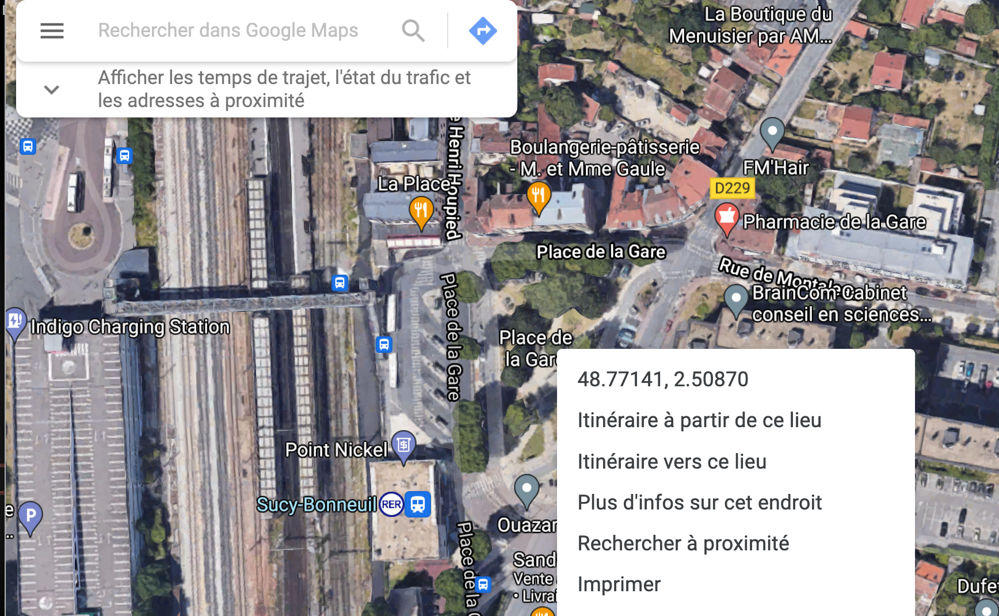

# Cartes dynamiques (CG) {#c22-leaflet}


```{r knitr_init, echo=FALSE, cache=FALSE, warning=FALSE}
library(knitr)
library(rmdformats)
library(leaflet)
library(htmlwidgets)
library(htmltools)
library(dplyr)
library(sf)

## Global options
options(max.print="80")
opts_chunk$set(echo=TRUE,
               cache=TRUE,
               prompt=FALSE,
               tidy=FALSE,
               comment=NA,
               message=FALSE,
               warning=FALSE,
               options(scipen=999))
opts_knit$set(width=75)
```

<p style="border:0.5px; border-style:solid; border-color:navajowhite3; padding: 1em; font-size:15px">
Ce cours propose de fournir les bases du logiciel Leaflet. Il est très largement inspiré d'un article d'Elena Salette publié sur l'excellent site de formation ThinkR et intitulé [Cartographie interactive : comment visualiser mes données spatiales de manière dynamique avec leaflet ?](https://thinkr.fr/cartographie-interactive-comment-visualiser-mes-donnees-spatiales-de-maniere-dynamique-avec-leaflet/) 
<br>
**Claude Grasland** (Professeur à l'Université de Paris)
</p>

<br>


## Introduction {-}

Les **cartes interactives** se sont multipliées depuis quelques années sur les différents types d'écran (ordinateur, tablette, smartphone, ...), le plus souvent sous la forme de figurés ponctuels (les fameuses "épingles" de Google) mais aussi désormais de plus en plus de grappes de points, de polygones ou de lignes. Le logiciel `Leaflet` a joué un rôle décisif dans cette révolution cartographique en raison de son caractère libre, de sa polyvalence en terme de langage (R, Python, ...) et bien évidemment de ses qualités intrinsèques.  Le package `Leaflet` est par ailleurs particulèrement adapté au couplage avec les **applications interactives** de type `Shiny` et plus généralement les outils de crétion de tableaux de bords (*dashboard*). Pour Elena Salette, c'es est clairement le logiciel de référence 
 
 
> Je dirais que `leaflet` est LA star des packages de cartes interactifs. On le voit partout, et même si on lui reproche parfois sa lenteur d’affichage, il est ultra complet, et la doc est vraiment bien faite : https://rstudio.github.io/leaflet/. Ce package utilise la librairie Javascript open source du même nom qui est largement utilisée (cf. la partie “Trusted by the best” sur https://leafletjs.com/ ).
Source : [Elena Salette, ThinkR, 25-08-2020](https://thinkr.fr/cartographie-interactive-comment-visualiser-mes-donnees-spatiales-de-maniere-dynamique-avec-leaflet/)
 
 Il n'est évidemment pas possible de donner en quelques heures une formation complète à Leaflet mais il est essentiel pour des étudiants se destinant au métier de data analyst ou de data scientist d'en maîtriser les bases, cde qui est l'objet du présent cours.
 
 
 > **BUG !** . : Pour une raison qui m'échappe, il peut arriver que la transformation du fichier .Rmd en .html ne s'opère pas et que vous voyiez apparaître le message d'erreur suivant **RMarkdown cannot knit: html_dependency not found**. Ce message d'erreur persiste même après avoir corrigé le code... ce qui est très pénible. Après avoir cherché sur les forums de discussion, j'ai trouvé une réponse [ici](https://stackoverflow.com/questions/53750383/rmarkdown-error-path-for-html-dependency-not-found) qui consiste simplement à aller sur **la flèche descendnate à droite du bouton knitr** et effectuer un **clear knitr cache** avant de relancer le Knitr. Apparemment ça marche, sans que je sache bien pourquoi ...


## Une carte élémentaire

### Lancement avec `leaflet()`

Nous allons avoir besoin des packages suivants :

- `Leaflet` puisque c'est l'objet même du cours !
- `dplyr` afin de pouvoir construire des programmes utilisant des pipes `%>%`
- `sf` pour charger des fonds de carte de différents types (points, lignes polygones)
- `htmltools` et `htmlwidgets` pour ajouter des popups interactifs sur notre carte

Pour vérifier que le package leaflet est bien installé, nous créons une première carte (vide !)

```{r}
map <- leaflet()

map
```

Et il n'y a ... RIEN ! si ce n'est un bouton de zoom


### Remplissage avec `addTiles()`

On ajoute sur ce fond de carte vide des "tuiles" cartographiques qui sont des images se modifiant selon l'échelle pour apporter plus ou moins de détails. Par défaut, le fonds de carte de référence est le fonds `OpenStreetMap`

```{r}
library(leaflet)

map <- leaflet() %>%
          addTiles()

map
```
La carte est désormais interactive et on peut effectuer des zooms ou se déplacer.


### Calage avec `setView()`

Nous allons ensuite choisir un point de référence, par exemple la place de la gare à Sucy-en-Brie. Pour trouver les coordonnées de latitude et longitude, la solution la plus simple est d'utiliser [Google Maps](https://www.google.fr/maps) puis de zoomer sur la zone d'étude et enfin d'**effectuer un click droit avec la souris sur le point dont on cherche les coordonnées** pour obtenir dans un popup les coordonnées recherchées : 


On peut alors procéder à une double opération de **centrage** de notre carte et de définition d'une **échelle d'observation** afin que la carte produite par `leaflet`couvre bien la zone qui nous intéresse. Cette double opération est réalisée à l'aide de la fonction `setView()` assortie des trois paramètre suivants :

- `lng =` pour la longitude
- `lat =` pour la latitude
- `zoom =` pour le degré d'aggrandissement de la carte de 1 pour le Monde entier à 20 pour une vision ulra locale


```{r}
map <- leaflet() %>% 
          addTiles() %>%
          setView(lat = 48.77141, lng=2.50870, zoom = 17)

map
```

Une fois qu'on a vérifié le centrage avec un zoom fort (ici 17), on peut refaire la carte en utilisant un zoom plus faible, par exemple un zoom de 12 permettant de visualiser toute la commune de Sucy et les communes voisines.

```{r}
map <- leaflet() %>% 
          addTiles() %>%
          setView(lat = 48.77141, lng=2.50870, zoom = 12)

map
```

### Personalisation avec  `addProviderTiles()`

Les tuiles OpenStreetMap qui servent de fonds de carte par défaut peuvent être remplacés par des tuiles personalisées fournies par des producteurs publics ou privés. On peut obtenir la liste des tuiles disponibles en tapant `providers` dans la console de R studio et les tester une par une. Mais il est souvent plus simple et plus rapide d'aller visualiser les tuiles disponibles sur [ce site web](http://leaflet-extras.github.io/leaflet-providers/preview/) où l'on peut centrer le monde sur sa zone d'étude et voir ce que donnent les différentes familles de tuiles. 

A titre d'exemple, les tuiles `Stamen.Watercolor` donnent une touche pastel artistique à la carte :


```{r}
map <- leaflet() %>% 
            addProviderTiles('Stamen.Watercolor') %>%
          setView(lat = 48.77141, lng=2.50870, zoom = 12)

map

```

Tandis que la couche `Esri.WorldTopoMap` fournit une imagerie précise mais de couleurs plus neutre que les tuiles `OpenStreetMap` , ce qui sera intéressant si on superspose des marqueurs de couleur vive. 


```{r}
map <- leaflet() %>% 
            addProviderTiles('Esri.WorldTopoMap') %>%
          setView(lat = 48.77141, lng=2.50870, zoom = 12)
map

```


### Affichage d'un point avec `addMarkers()`

L'usage le plus fréquent de `leaflet`consiste à ajouter des éléments de localisation ponctuelle appelés `markers`et de rendre ces objets ponctuels interactifs avec l'ouverture de fenêtres `popups`lorsqu'on clique dessus avec la souris. On va donc voir pas à pas comment construire de telles cartes interactives en partant du cas le plus simple (marqueur unique) pour aller vers les cas plus complexes (ensemble de marqueurs de taille, couleur et formes différentes).

Nous allons commencer par indiquer l'emplacement de la place de la gare de Sucy-en-Brie sur notre carte précédente à l'aide de la fonction `addMarkers()` : 

```{r}
map <- leaflet() %>% 
            addProviderTiles('Esri.WorldTopoMap') %>%
            setView(lat = 48.77141, lng=2.50870, zoom = 12) %>% 
            addMarkers(lat = 48.77141, lng=2.50870)
map
```
On constate que le marqueur donne bien la position choisi mais n'est pas interactif. Il faut ajouter plus de paramètres pour assurer l'interactivité. 

### Ajout d'un `label`ou d'un `popup`

On peut définir deux comportements d'un marker selon que la souris ne fait que passer dessus (`label`) ou selon que l'utilisateur effectue un click sur marker et déclenche l'ouverture d'une fenêtre (`popup`). Dans sa version la plus simple, l'interactivité consiste à ajouter une chaîne de caractère à ces deux paramètres. 

```{r}
icone_gare <-makeIcon(iconUrl = "img/gare_sucy_coord_googlemap.png")
map <- leaflet() %>% 
            addProviderTiles('Esri.WorldTopoMap') %>%
            setView(lat = 48.77141, lng=2.50870, zoom = 12) %>% 
            addMarkers(lat = 48.77141, lng=2.50870,
                      # En passant la souris
                      label = "GARE DE SUCY-BONNEUIL", 
                      # En cliquant sur l'icone
                       popup = "La gare RER A de Sucy Bonneuil est bien reliée aux communes 
                                 environnantes par un réseau de bus partant dans toutes les directions")
map
```


### Amélioration du `popup`

Mais on peut faire beaucoup mieux, notamment pour la fenêtre `popup`qui peut prendre la forme d'une mini-page web dont on fixe le contenu en html avec la fonction `paste0()` et les dimensions avec le sous-paramètre `popupOptions()`. 


```{r}


# Préparation de la fenêtre Popup
    my_popup = paste0(
      "<b> LA GARE DE SUCY",
      "</b><br/><br/>",
      "La gare RER A de Sucy Bonneuil est bien reliée aux communes 
                                 environnantes par un réseau de bus partant dans toutes les directions")


  
# Réalisation de la carte
map <- leaflet() %>% 
            addProviderTiles('Esri.WorldTopoMap') %>%
            setView(lat = 48.77141, lng=2.50870, zoom = 12) %>% 
            addMarkers(lat = 48.77141, lng=2.50870,
                      # En passant la souris
                      label = "GARE DE SUCY-BONNEUIL", 
                      # En cliquant sur l'icone
                       popup = my_popup, 
                      # Quelques options de la popup
                        popupOptions = 
                      list(maxHeight = 150, maxWidth = 200))
map

```

Et voila, le tour est joué ! 


## Une carte statistique 

### Préparation des données


On prend comme exemple les données relatives au nombres de personnes résidant en HLM dans une sélection de communes du Val de Marne à l'échelle des IRIS. Le fichier doit être impérativement au format `sf` et on s'en s'assure en passant la fonction `st_as_sf()`
`

```{r}
mapiris<-readRDS("data/sel_map_pop_hlm.Rdata") # Fichier
mapiris<-st_as_sf(mapiris) # vérifie que le format est bien sf
head(mapiris)
```


Les coordonnées géométriques sont actuellement projetées selon la projection `(crs = RF93_Lambert_93` qui est la projection de référence utilisée en France. Cette projection permet de calculer au mieux les distances avec une précision de l'ordre du mètre. 

Mais les données ainsi projetées ne sont pas utilisables par `leaflet`qui attend des coordonnées de latitude et longitude non projetées . On doit donc reprojeter le fond de carte pour le rendre utilisable par Leaflet et ajouter des colonnes lat et lng. Cela se fait facilement avec la fonction `st_transform()`du package sf en lui donnant comme paramètre `(crs=4326)` ce qui correspond à la projection WGS 84. 


```{r}
mapiris<-mapiris  %>% st_transform(crs = 4326)
head(mapiris)
```


Le fichier est en apparence le même mais les coordonnées de la variable *geometry* sont désormais en degrés décimaux. Et on peut du coup extraire pour chaque polygone les coordonnées du point central à l'aide des fonctions `st_centroid()` et `st_coordinates()`


```{r}
coo<-st_coordinates(st_centroid(mapiris))
head(coo)
```

On ajoute ces deux variables de coordonnées dans notre fichier principal pour pouvoir les combiner avec les autres variables 

```{r}
mapiris$lng<-coo[,1]
mapiris$lat<-coo[,2]
```


si nous de disposons pas déjà d'une carte de communes, on peut la réaliser facilement en agrégeant les données IRIS par la variable NOM_COM puis ajouter les centroïdes de ces dernières comme on l'a fait pour les IRIS.

```{r}
mapcom <- mapiris %>% group_by(NOM_COM) %>% summarise() %>% st_as_sf()
coo<-st_coordinates(st_centroid(mapcom))
mapcom$lng<-coo[,1]
mapcom$lat<-coo[,2]
```
Un message nous avertit qu'il aurait mieux valu calculer les centroïdes sur des données projetées mais ce n'est pas absolument indispensable si l'on ne cherche pas une précision absolue. 


### Contours des iris et communes avec `addPolygons()`

La fonction leaflet de base pour tracer des polygones est `addPolygons()`  qui est l'équivalent de `addMarkers()` que l'on a vu précédemment. Mais la différence importante est que l'on peut désormais fournir un fichier sf aux fonctions `addPolygons` et `addMarkers` puis accéder aux variables contenues dans ce fichier en utilisant un tilde '~'suivi du nom de la variable.  


On peut par exemple construire une carte des communes avec un label donnant le nom

```{r}
# Réalisation de la carte
map <- leaflet() %>% 
            addProviderTiles('Esri.WorldTopoMap') %>%
            setView(lat = 48.77, lng=2.53, zoom = 12) %>% 
            addPolygons(data = mapcom,
                        color = c("red","orange","yellow","green","blue"),
                        label = ~NOM_COM)
map
```
On peut superposer plusieurs cartes de polygones à condition que certaines soient composée uniquement de lignes de contour (`fill = `) dont on peut régler l'épaisseur (`weight= `) ou la couleur (`color =`). Les labels ou popup ne pourront a priori concerner également qu'une seule couche. 

```{r}

# Ajout de la variable couleur
mapiris$comcolor<-as.factor(mapiris$NOM_COM)
levels(mapiris$comcolor)<-c("red","orange","yellow","green","blue")


# Réalisation de la carte
map <- leaflet() %>% 
            addProviderTiles('Esri.WorldTopoMap') %>%
            setView(lat = 48.77, lng=2.53, zoom = 12) %>% 
            addPolygons(data = mapiris,
                        fill = TRUE,
                        color = ~comcolor,
                        label = ~NOM_IRIS,
                        weight = 1) %>%
            addPolygons(data = mapcom,
                        fill = FALSE,
                        color = "black",
                        weight = 2)
map
```


### Cartes choroplèthes avec `addPolygon()` et `colorBin()`


De la même manière que nous avons affiché la couleur des communes  dans chaque IRIS, nous pouvons proposer une carte choroplèthe du % de personnes habitant dans des HLM et ajouter un popup donnant la valeur de l'indicateur si l'on clique. La seule difficulté est de préparer une palette de couleur à l'aide de l'une des fonction `colorNumeric()`, `colorBin()`, `colorQuantile()` ou `colorFactor()`. 

Voyons un exemple sur la variable pct_1 qui est le % de logements sociaux. Supposons que l'on veuille examiner la part des logements sociaux qui sont très supérieurs ou très inférieurs à 20% en prenant des classes qui suivent une progression géométrique : 

```{r}
# Choix de la variable
   myvar <-mapiris$pct_1
# Choix des classes 
    mycut<-c(0, 5, 10, 20,40,100)
# Choix de la palette (c'est une fonction !)
   mypal <- colorBin('RdYlBu', 
                       myvar,
                       bins=mycut)
   
# Préparation des popups
 #     mypop <- lapply(seq(nrow(mapiris)), function(i) {
#      paste0(  paste("Commune :",mapiris$NOM_COM[i]), '<p>',
#               paste("Iris : " ,mapiris$NOM_IRIS[i]), '<p>', 
#               paste("% pop. en HLM :", mapiris$pct_1[i])
#            ) 
#            })
#      mypop<-lapply(labs, htmltools::HTML)


# Réalisation de la carte
map <- leaflet() %>% 
            addProviderTiles('Esri.WorldTopoMap') %>%
            setView(lat = 48.77, lng=2.53, zoom = 12) %>% 
            addPolygons(data = mapiris,
                        fillColor = ~mypal(pct_1),
                        fillOpacity = 0.5,
                        color = "white",
                        label = ~pct_1,
 #                       popup = mypop,
                        weight = 1) %>%
            addLegend(data = mapiris,
                      pal = mypal, 
                      title = "% population en HLM",
                      values =~pct_1, 
                      position = 'topright') %>%
            addPolygons(data = mapcom,
                        fill = FALSE,
                        color = "black",
                        weight = 2)
map
```


### Cartes de stock avec `addCircleMarkers()`

Notre carte est intéressante mais elle ne permet pas de voir quelle est la population concernée par le logement social. En effet, certains IRIS sont très étendus alors qu'ils regroupent peu de population et d'autres sont très petits mais comporte beaucoup de logements sociaux. Ce qui est logique puisque les HLM sont le plus souvent des immeubles à plusieurs étages.

Nous allons donc superposer sur la carte précédente le nombre de personnes vivant en logement social. Puisqu'il s'agit d'un stock, nous devrons utiliser un figuré ponctuel avec une surface proportionnelle au nombre d'habitants des logements sociaux.


```{r}
# Choix de la variable
   myvar <-mapiris$pct_1
# Choix des classes 
    mycut<-c(0, 5, 10, 20,40,100)
# Choix de la palette (c'est une fonction !)
   mypal <- colorBin('RdYlBu', 
                       myvar,
                       bins=mycut)
  
   
# Calcul du diamètre des cercles
   myradius <-8*sqrt(mapiris$count_1/max(mapiris$count_1))
# Préparation des popups
 #     mypop <- lapply(seq(nrow(mapiris)), function(i) {
#      paste0(  paste("Commune :",mapiris$NOM_COM[i]), '<p>',
#               paste("Iris : " ,mapiris$NOM_IRIS[i]), '<p>', 
#               paste("% pop. en HLM :", mapiris$pct_1[i])
#            ) 
#            })
#      mypop<-lapply(labs, htmltools::HTML)


# Réalisation de la carte
map <- leaflet() %>% 
            addProviderTiles('Esri.WorldTopoMap') %>%
            setView(lat = 48.77, lng=2.53, zoom = 12) %>% 
            addPolygons(data = mapiris,
                        fillColor = ~mypal(pct_1),
                        fillOpacity = 0.5,
                        color = "white",
                        label = ~pct_1,
 #                       popup = mypop,
                        weight = 1) %>%
            addLegend(data = mapiris,
                      pal = mypal, 
                      title = "% population en HLM",
                      values =~pct_1, 
                      position = 'topright') %>%
             addCircleMarkers(data=mapiris,
                              lat = ~lat,
                              lng = ~lng,
                              radius = myradius,
                              stroke = FALSE,
                              label = ~count_1,
                              fillColor = "gray50",
                              fillOpacity = 0.5)%>%
            addPolygons(data = mapcom,
                        fill = FALSE,
                        color = "black",
                        weight = 2)
map
```

### Finition avec un `popup` et `highlightOptions()`

Et pour terminer notre belle carte, nous allons ajouter une fenêtre popup apportant à l'utilisateur tous les renseignements sur chaque IRIS. Pour cela nous allons devoir construire chaque fenêtre popup au format HTML préalablement à l'affichage des cartes en utilisant des outils issus sdes packaghes `htmltools`et `htmlwidgets`. On supprime les labels des deux couches, l'utilisateur ayant désormais juste à cliquer sur un Iris pour obtenir tous les renseignements dans une seule fenêtre

On ajoute au passage un paramètre `highlighOptions()` pour que les iris au dessus desquels passe la souris soient mis en valeur par un trait de contour spécifique. On verra ainsi mieux à quelle zone s'applique le popup de renseignement. 


```{r}
# Choix de la variable
   myvar <-mapiris$pct_1
# Choix des classes 
    mycut<-c(0, 5, 10, 20,40,100)
# Choix de la palette (c'est une fonction !)
   mypal <- colorBin('RdYlBu', 
                       myvar,
                       bins=mycut)
  
   
# Calcul du diamètre des cercles
   myradius <-8*sqrt(mapiris$count_1/max(mapiris$count_1))
   
# Préparation des popups
      mypopups <- lapply(seq(nrow(mapiris)), function(i) {
      paste0(  paste("Commune           : ",mapiris$NOM_COM[i]), '<br>',
               paste("Iris              : " ,mapiris$NOM_IRIS[i]), '<br>', 
               paste("Population totale : " ,mapiris$count_1[i]+mapiris$count_2[i]), '<br>', 
               paste("Population en HLM : " ,mapiris$count_1[i]), '<br>',                
               paste("% pop. en HLM     :", mapiris$pct_1[i])
            ) 
            })
      mypopups<-lapply(mypopups, htmltools::HTML)


# Réalisation de la carte
map <- leaflet() %>% 
            addProviderTiles('Esri.WorldTopoMap') %>%
            setView(lat = 48.77, lng=2.53, zoom = 13) %>% 
            addPolygons(data = mapiris,
                        fillColor = ~mypal(pct_1),
                        fillOpacity = 0.5,
                        color = "white",
                        popup = mypopups,
                        weight = 1,
                        highlightOptions = highlightOptions(weight = 3, color = 'green')) %>%
            addLegend(data = mapiris,
                      pal = mypal, 
                      title = "% population en HLM",
                      values =~pct_1, 
                      position = 'topright') %>%
             addCircleMarkers(data=mapiris,
                              lat = ~lat,
                              lng = ~lng,
                              radius = myradius,
                              stroke = FALSE,
                              fillColor = "gray50",
                              fillOpacity = 0.5)%>%
            addPolygons(data = mapcom,
                        fill = FALSE,
                        color = "black",
                        weight = 2)
map
```
